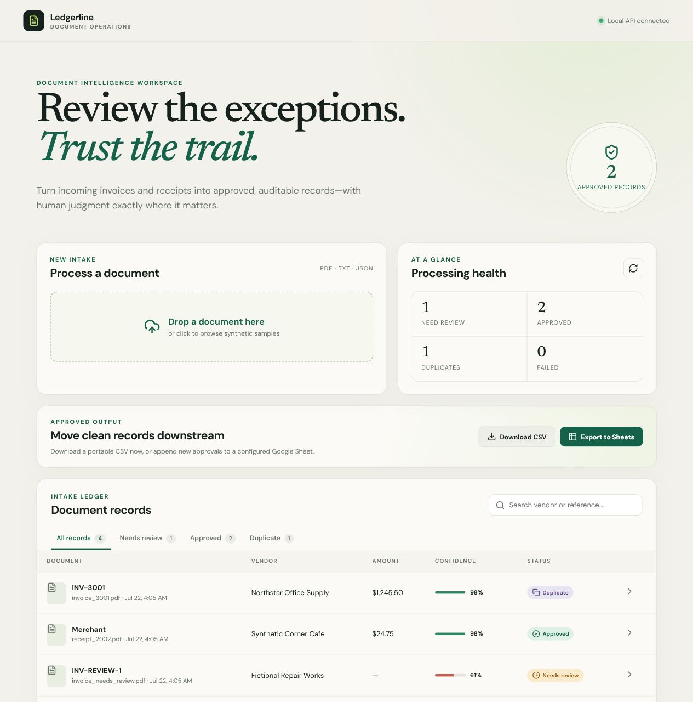
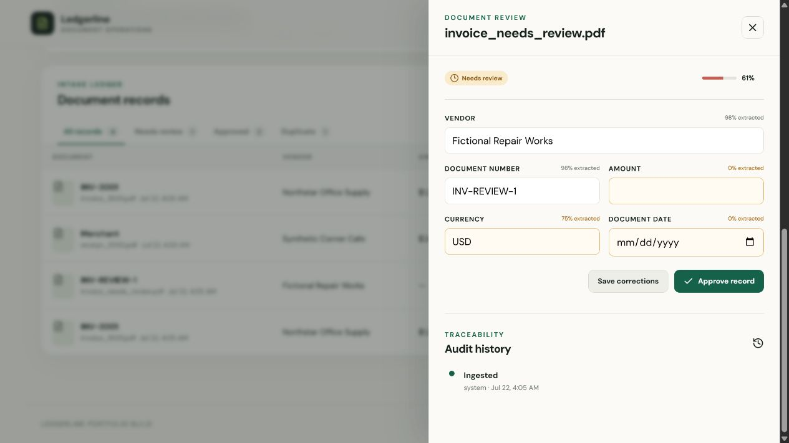
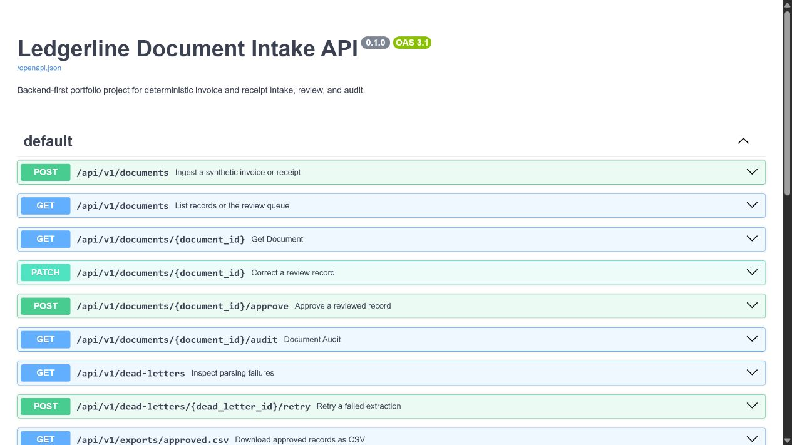
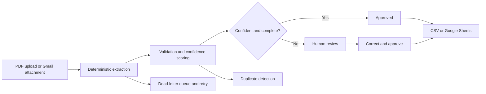

# Ledgerline

A full-stack document intake and human-review application. Ledgerline ingests **synthetic** invoice and receipt PDFs, extracts validated fields with deterministic rules, scores confidence, detects duplicates, and routes uncertain records to an auditable review queue.

The project is designed as a privacy-safe portfolio demonstration: fixtures are fictional, integrations are opt-in, and credentials are excluded from version control.



<details>
<summary>Review workflow and API documentation</summary>





</details>

## Why it exists

Manual document intake is slow, repetitive, and difficult to audit. Ledgerline automates high-confidence records while preserving human judgment for incomplete or uncertain documents. Every correction and approval is recorded, so automation never removes accountability.



## Engineering highlights

- **Deterministic by default:** PyMuPDF extraction and explicit parsing rules keep results explainable and testable.
- **Human-in-the-loop controls:** low-confidence or incomplete records enter a React review workflow instead of being silently accepted.
- **Idempotent processing:** content hashes and business keys prevent repeated uploads and Gmail retries from creating duplicate records.
- **Operational traceability:** audit events, timestamps, retry counters, failure details, and a durable dead-letter queue make processing observable.
- **Portable deployment:** SQLite supports a one-command local evaluation; Docker Compose runs React, FastAPI, and PostgreSQL together.

## Implemented

- FastAPI and Pydantic API with interactive OpenAPI documentation
- React, TypeScript, and Vite review dashboard
- upload, status filters, confidence visualization, corrections, approvals, audit history, and dead-letter retry UI
- approved-record CSV download and idempotent Google Sheets export
- SQLAlchemy models supporting SQLite locally and PostgreSQL in Docker
- deterministic PyMuPDF extraction for PDF, plus TXT and JSON compatibility
- field-level and aggregate confidence scores
- content-hash and business-key duplicate detection
- review queue, corrections, approval rules, timestamps, and audit history
- durable database dead letters for unreadable documents
- retry counts and a dead-letter retry endpoint
- Gmail OAuth attachment ingestion with per-attachment idempotency and optional processing summaries
- Pytest, Ruff, GitHub Actions, Dockerfile, and Docker Compose

## Technology

| Layer | Implementation |
| --- | --- |
| API and validation | Python, FastAPI, Pydantic |
| Persistence | SQLAlchemy, SQLite, PostgreSQL |
| Extraction | PyMuPDF with deterministic field rules |
| Dashboard | React, TypeScript, Vite |
| Integrations | Gmail OAuth, Google Sheets, CSV |
| Quality | Pytest, Vitest, ESLint, Ruff, GitHub Actions |
| Deployment | Docker, Docker Compose, Nginx |

## Quick start

Requirements: Python 3.11+, Node.js 22+, and npm.

```powershell
python -m venv .venv
.\.venv\Scripts\Activate.ps1
pip install -e ".[dev]"
uvicorn app.main:app --reload
```

Open [http://localhost:8000/docs](http://localhost:8000/docs). SQLite creates `document_intake.db` automatically.

In a second terminal, run the dashboard:

```powershell
cd frontend
npm install
npm run dev
```

Open [http://localhost:5173](http://localhost:5173). The frontend expects the API at `http://127.0.0.1:8000/api/v1`; override it with `VITE_API_URL` in `frontend/.env.local` when needed.

Upload one of the generated fixtures from `sample-data/synthetic-pdfs/`. The high-confidence invoice is approved automatically; `invoice_needs_review.pdf` demonstrates correction and approval in the dashboard.

```powershell
ruff check app tests
pytest --cov=app --cov-report=term-missing
```

For the complete React + FastAPI + PostgreSQL stack:

```powershell
docker compose up --build
```

Then open [http://localhost:5173](http://localhost:5173). API documentation remains available at [http://localhost:8000/docs](http://localhost:8000/docs).

Regenerate the fictional PDF fixtures with `python scripts/generate_synthetic_pdfs.py`.

## API workflow

1. `POST /api/v1/documents` with a synthetic PDF, TXT, or JSON file.
2. Inspect `confidence`, `field_confidence`, `status`, and `duplicate_of_id`.
3. `GET /api/v1/documents?status=review` for the review queue.
4. `PATCH /api/v1/documents/{id}` to correct fields.
5. `POST /api/v1/documents/{id}/approve` to approve a complete, non-duplicate record.
6. `GET /api/v1/documents/{id}/audit` for event history.
7. `GET /api/v1/dead-letters` for extraction failures.
8. `GET /api/v1/exports/approved.csv` to download approved records.
9. `POST /api/v1/exports/google-sheets` to append approvals not previously exported.

FastAPI publishes the complete interactive OpenAPI contract at `/docs`; the dashboard uses the same public endpoints documented there.

## Google Sheets setup (optional)

CSV export requires no credentials. To enable Google Sheets locally:

1. Create a Google Cloud project and enable the Google Sheets API.
2. Create a service account and download its JSON key.
3. Save the key as `credentials/service-account.json`. The entire `credentials/` directory is ignored by Git.
4. Create a spreadsheet with a tab named `Approved Records`.
5. Share that spreadsheet with the service account's `client_email` as an editor.
6. Copy `.env.example` to `.env` and set:

```dotenv
GOOGLE_SHEETS_CREDENTIALS_FILE=credentials/service-account.json
GOOGLE_SHEETS_SPREADSHEET_ID=the_id_between_d_and_edit_in_the_sheet_url
GOOGLE_SHEETS_RANGE=Approved Records!A:I
```

Restart FastAPI after changing `.env`. The exporter creates the header row when needed and uses audit events to avoid appending the same approved record twice. See Google's official [Sheets values guide](https://developers.google.com/workspace/sheets/api/guides/values) for the underlying append behavior.

## Gmail attachment intake (optional)

Gmail access is local and opt-in. No mailbox credentials or tokens belong in Git.

1. Enable the Gmail API, configure an External OAuth app in Testing, and add your Gmail address as a test user.
2. Create a Desktop app OAuth client and save it as `credentials/gmail-client.json`.
3. Authorize once:

```powershell
python scripts/gmail_auth.py
```

Google opens a consent page. After approval, the ignored `credentials/gmail-token.json` file stores the refresh token.

4. Process matching PDF attachments without sending email:

```powershell
python scripts/process_gmail.py
```

The default search is `has:attachment filename:pdf newer_than:30d`. Each Gmail message/attachment pair is tracked, so later runs skip it.

5. To send the summary, set your recipient in `.env`:

```dotenv
GMAIL_SUMMARY_RECIPIENT=your-address@example.com
```

Then explicitly request sending:

```powershell
python scripts/process_gmail.py --send-summary
```

OAuth scopes are limited to `gmail.readonly` and `gmail.send`. The processor reports scanned messages, attachments, approvals, reviews, duplicates, failures, and skips. See Google's official [Python quickstart](https://developers.google.com/workspace/gmail/api/quickstart/python) and [sending guide](https://developers.google.com/workspace/gmail/api/guides/sending).

## Optional n8n orchestration

Ledgerline does not require n8n. An n8n workflow can be added as an orchestration layer—Gmail trigger, attachment download, API upload, status-based routing, notifications, and scheduled retries—while FastAPI remains responsible for parsing, validation, deduplication, review state, and audit history. Exported workflows must contain no credentials, and any public webhook should be authenticated.

## Confidence and privacy

Each recognized field receives a deterministic confidence score; the aggregate is their mean. Missing required fields or a score below `REVIEW_THRESHOLD` routes the record to review. A future LLM fallback may run only behind this low-confidence boundary; none is enabled now.

All fixtures and names are fictional. `.env.example` contains configuration only. `.env`, OAuth tokens, service-account keys, local databases, exports, and uploaded files are ignored by Git.

## Verification

The repository currently contains 15 backend tests and 3 frontend tests covering extraction, review, duplicates, audit history, exports, Gmail processing, and dashboard behavior.

```powershell
python -m ruff check app tests scripts/gmail_auth.py scripts/process_gmail.py scripts/generate_synthetic_pdfs.py
python -m pytest --cov=app --cov-report=term-missing
cd frontend
npm test
npm run lint
npm run build
```

GitHub Actions runs these checks on every push and pull request.

## Roadmap

- authenticated optional n8n webhook and example workflow
- optional low-confidence LLM extraction with provenance
